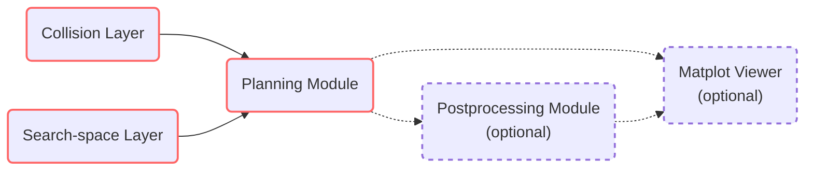

# CorgiPath: Customizable Path Planner


[](https://github.com/ryul1206/corgipath/blob/main/LICENSE)

Here is a simple flow chart:



## Installation

<!-- ```sh
poetry build
``` -->

## Build your own planner

Development in vscode

```
poetry config virtualenvs.in-project true
poetry config virtualenvs.path "./.venv"
```

## Contribute

Thanks for taking the time to contribute!

- We recommend developing in [a virtual environment using Poetry](https://python-poetry.org/docs/basic-usage#using-your-virtual-environment).
